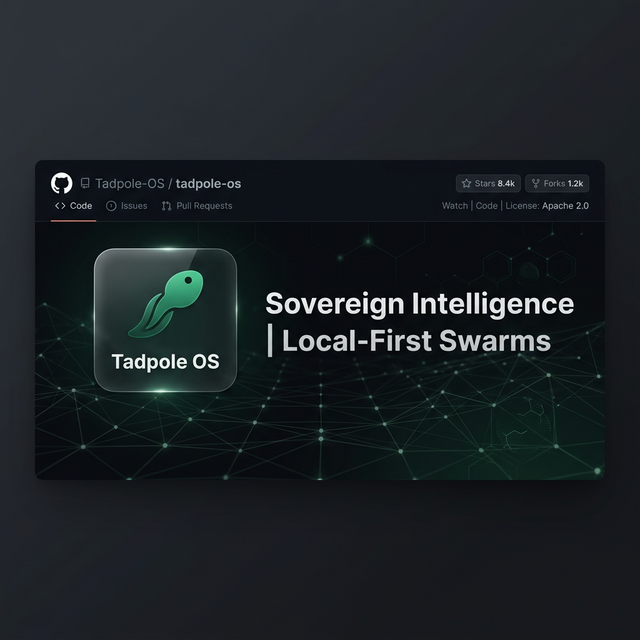

  

  # 🚀 Tadpole OS Marketing Hub
  **The high-performance, Astro-powered gateway to the Sovereign Protocol.**

  
  
  
  
  ---

This repository contains the source code for the official **Tadpole OS** marketing website, built with **Astro** for zero-JS performance and extreme search engine discoverability.

## 🌟 Key Features

- **Zero-JS by Default**: Pure HTML/CSS output for near-instant load times and AI agent crawling.
- **Sovereign Dark Theme**: Deep visual alignment with the core Tadpole OS engine.
- **GEO Optimized**: Structured data (JSON-LD) and agent-friendly meta tags.
- **Governance Whitepaper**: Integrated Sovereign Protocol documentation.

## 🛠️ Tech Stack

- **Framework**: [Astro](https://astro.build/)
- **Styling**: [Tailwind CSS](https://tailwindcss.com/)
- **Deployment**: [GitHub Pages](https://pages.github.com/) (Recommended)

## 🧞 Development Commands

All commands are run from the root of the project:

| Command | Action |
| :--- | :--- |
| `npm install` | Installs dependencies |
| `npm run dev` | Starts local dev server at `localhost:4321` |
| `npm run build` | Build your production site to `./dist/` |
| `npm run preview` | Preview your build locally |

## 📐 GEO Strategy

Tadpole OS Marketing is built with **Generative Engine Optimization** in mind. We prioritize:
1. **Semantic HTML**: Clear heading hierarchies for LLM decomposition.
2. **Structured Data**: Schema.org JSON-LD for SoftwareApplication and FAQ.
3. **Flat Navigation**: Minimizing crawl depth for easier indexing.

---

[Return to Core Engine](https://github.com/DDS-Solutions/TadPole-OS)
